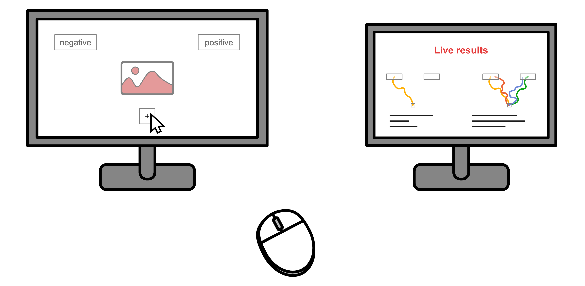

# Live motor task

This repository contains the code to run a demonstration of a mouse tracker experimental task with live updating result plots. Once deployed, the demonstration can occupy two displays, with the experimental task on one, and the live updating plots on the other (see *figure 1*).



*Figure 1: Illustration of how the setup would look on two monitors.*


### What this is

The present code is structured in two main parts: a **Psychopy** script, running a mouse tracking psychophysical task, and a **Dash app**, using *plotly* to process the data created through the task, and plot it continuously.

**The stimuli**

The demonstration is centered around a series of images containing positive or negative content, where several variables can influence their perception as being positive or negative. This includes the valence of the context, of the people in the image, whether they interact, and the congruency between these different variables. These images are chosen to pose a challenge to the user, as they often will be difficult to rapidly classify as positive or negative overall.

**The Psychopy task**

The Psychopy task is a **motor movement experiment**. In it, the user is prompted to classify images as positive or negative. These images appear at the center of the screen when trials start, and are rated by clicking on buttons positioned at the top left and top right of the screen. Throughout trials, mouse position is recorded and is the variable of interest to all the subsequent analyses. More precisely, as done elsewhere in actual experiments (see e.g. [Koenig-Roberts et al. 2024](https://doi.org/10.1038/s41598-024-62135-7)), the horizontal position is extracted across time points, and averaged per image.

**The Dash app**

The Dash app contains plotting tools to visualise the data created during the Psychopy task. It produces a series of graphs, and refreshes frequently to update the data showed on the graphs. The layout of the app is divided into the following parts:

1. **Mouse trajectories**: at the top of the page, two plots mimicking the display of the mouse tracking task show the last trial trajectory (left) and all the trajectories alongside the average trajectories per condition (right).
2. **Time-resolved correlations**: in second place are a series of correlation plots showing the correlation of the image-wise average horizontal positions across time with the ratings given to these same images by several factors of interest (brain ROIs and GPT).
3. **Ratings from factors of interest**: below this is a table that shows the exact ratings given by the factors of interest, for each image and based on different variables of interest in the images (valence of the context, of the people, or of the overall image).

### How to launch

To run the full project, run `main.py`. This will start both the Psychopy task and the Dash app. You will be prompted to choose a display on which to run the motor task. Copy the Dash app URL to any browser, and the data analysis will begin. As soon as the motor experiment starts, data will be generated and shown on the app.

### Repository tree

(TODO: Fix the tree below)

```
live-motor-task
├── app                  # All app-related files (Dash app)
│   ├── assets           # CSS, JS, or other static assets
│   │   └── styles.css
│   └── app.py           # Main app file
├── data                 # All experiment data
│   ├── 2024-12-23-1627_task-livemotortask.json
│   ├── (yyyy-mm-dd-hhmm_task-taskname).json
│   └── ...
├── experiment           # PsychoPy experiment
│   ├── mouse_tracker_task.py  # Main experiment file
│   ├── mock_images.py   # Supporting experiment script
│   └── dont_delete.py   # Supporting experiment script
├── plot_utils           # Data visualization utilities
│   └── plot_utils.py    # Core plotting functions
├── readme_files
├── src                  # Core utilities shared by app and experiments
│   ├── __init__.py
│   ├── psychopy_utils.py
│   ├── utils.py
│   └── external         # External data or configs
│       ├── boxes_kwargs.json
│       ├── lists.json
│       └── ratings.tsv
├── stimuli              # Stimuli used in experiments
│   ├── beach_interaction_positive_congruent.jpg
│   ├── (context_people-interaction_people-valence_congruency).jpg
│   └── ...
├── main.py              # Central entry point to launch both app and experiment
├── README.md
└── requirements.txt
```


### Properties

The Psychopy task is built for demonstration purposes and not as an exact scientific experiment.

- On each run, it will show all the images in random order, and repeat indefinitely if not interrupted.
- It will create one data file per run, with a timestamp to differentiate it from the others.
- To restart the task for a subsequent participant, press 'R'.
- To exit the task, press 'escape'.
- Trials that aren't successfully completed will be repeated until a response is correctly given.

The Dash app has the following properties:

- Plotting can be done using all the data, or only that of the last participant by selecting options in the top-left drop-down menu.
- Data can be divided into different series of conditions by selecting options in the top-right drop-down menu.